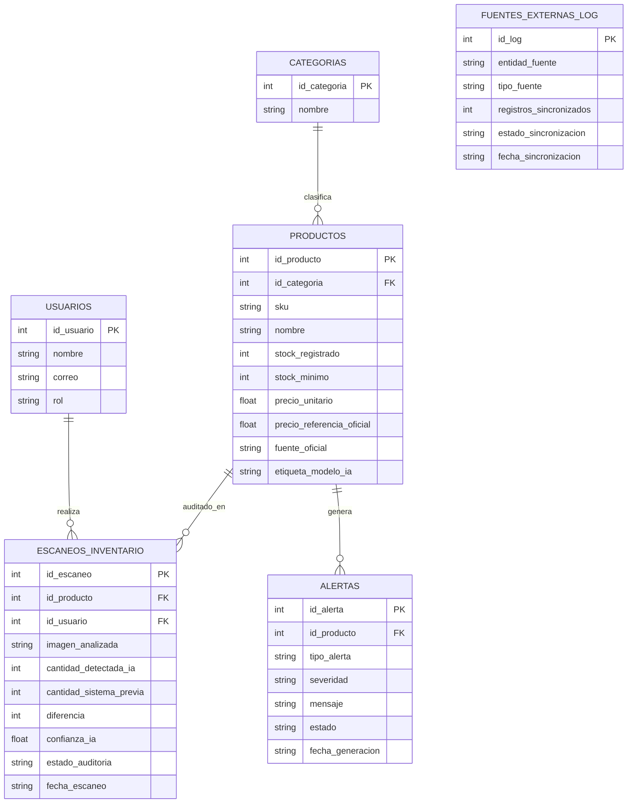
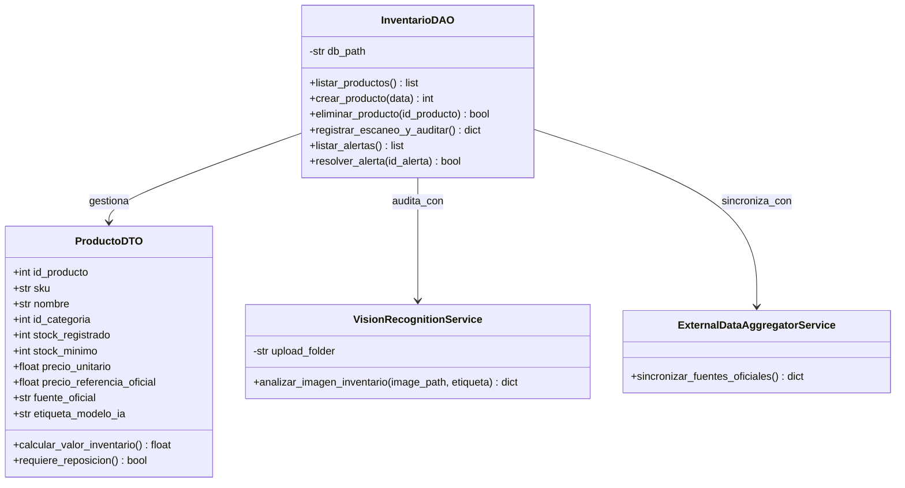

# Diagramas de Diseño y Arquitectura - InventarioVision AQP

## 1. Diagrama Entidad-Relación (Mermaid)

```mermaid
erDiagram
    USUARIOS ||--o{ ESCANEOS_INVENTARIO : realiza
    CATEGORIAS ||--o{ PRODUCTOS : clasifica
    PRODUCTOS ||--o{ ESCANEOS_INVENTARIO : auditado_en
    PRODUCTOS ||--o{ ALERTAS : genera

    USUARIOS {
        int id_usuario PK
        string nombre
        string correo
        string rol
    }
    CATEGORIAS {
        int id_categoria PK
        string nombre
    }
    PRODUCTOS {
        int id_producto PK
        int id_categoria FK
        string sku
        string nombre
        int stock_registrado
        int stock_minimo
        float precio_unitario
        float precio_referencia_oficial
        string fuente_oficial
        string etiqueta_modelo_ia
    }
    ESCANEOS_INVENTARIO {
        int id_escaneo PK
        int id_producto FK
        int id_usuario FK
        string imagen_analizada
        int cantidad_detectada_ia
        int cantidad_sistema_previa
        int diferencia
        float confianza_ia
        string estado_auditoria
        string fecha_escaneo
    }
    ALERTAS {
        int id_alerta PK
        int id_producto FK
        string tipo_alerta
        string severidad
        string mensaje
        string estado
        string fecha_generacion
    }
    FUENTES_EXTERNAS_LOG {
        int id_log PK
        string entidad_fuente
        string tipo_fuente
        int registros_sincronizados
        string estado_sincronizacion
        string fecha_sincronizacion
    }
```

## 2. Diagrama de Clases UML (Backend Python POO)

```mermaid
classDiagram
    class ProductoDTO {
        +int id_producto
        +str sku
        +str nombre
        +int id_categoria
        +int stock_registrado
        +int stock_minimo
        +float precio_unitario
        +float precio_referencia_oficial
        +str fuente_oficial
        +str etiqueta_modelo_ia
        +calcular_valor_inventario() float
        +requiere_reposicion() bool
    }
    class InventarioDAO {
        -str db_path
        +listar_productos() list
        +crear_producto(data) int
        +eliminar_producto(id_producto) bool
        +registrar_escaneo_y_auditar() dict
        +listar_alertas() list
        +resolver_alerta(id_alerta) bool
    }
    class VisionRecognitionService {
        -str upload_folder
        +analizar_imagen_inventario(image_path, etiqueta) dict
    }
    class ExternalDataAggregatorService {
        +sincronizar_fuentes_oficiales() dict
    }

    InventarioDAO --> ProductoDTO : gestiona
    InventarioDAO --> VisionRecognitionService : audita_con
    InventarioDAO --> ExternalDataAggregatorService : sincroniza_con
```